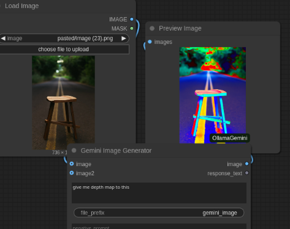
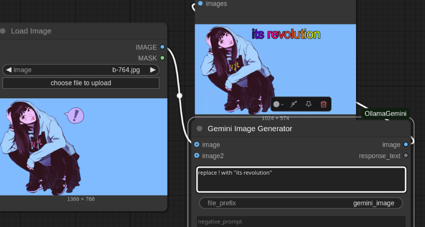
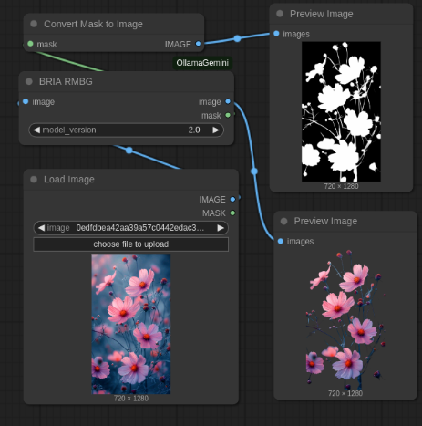
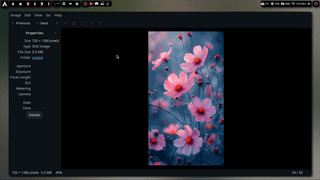
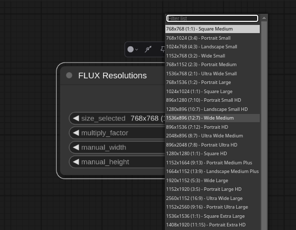
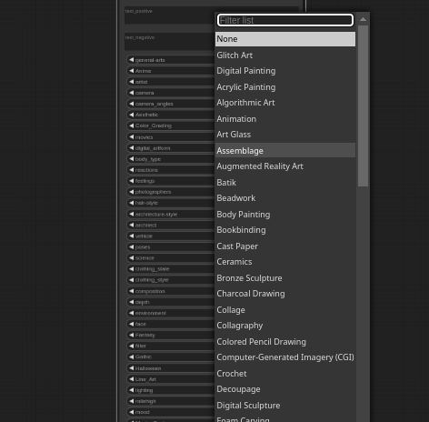

<div align="center">

# 🚀 ComfyUI GeminiOllama Extension

**Supercharge your ComfyUI workflows with AI superpowers**

[](https://github.com/al-swaiti/ComfyUI-OllamaGemini/stargazers)
[](https://opensource.org/licenses/MIT)
[](https://www.python.org/downloads/release/python-3100/)

</div>

This extension integrates Google's Gemini API, OpenAI (ChatGPT), Anthropic's Claude, Ollama, Qwen, and various image processing tools into ComfyUI, allowing users to leverage these powerful models and features directly within their ComfyUI workflows.

## Features

<div align="left">

### 1️⃣ Multiple AI API Integrations

https://github.com/user-attachments/assets/6ffba8bc-47e9-42c5-be98-5849ffb03547

- **Google Gemini**: Access gemini-2.0-pro, gemini-2.0-flash, gemini-1.5-pro and more with dynamic model list updates
- **OpenAI**: Use gpt-4o, gpt-4-turbo, gpt-3.5-turbo, and DeepSeek models with automatic model discovery
- **Anthropic Claude**: Leverage claude-3.7-sonnet, claude-3.5-sonnet, claude-3-opus and more
- **Alibaba Qwen**: Access qwen-max, qwen-plus, qwen-turbo models
- **Ollama**: Run local models with customizable parameters
- **Video & Audio Support**: Process video frames and audio inputs with Gemini and Ollama

### 2️⃣ Advanced Prompt Engineering


- Transform simple prompts into detailed, model-specific instructions
- Extensively researched prompt templates optimized for different models:
  - **SDXL**: Premium tag-based prompts with precise artistic control, structured in order of importance
  - **FLUX.1-dev**: Hyper-detailed cinematographic prompts with technical precision and artistic vision
  - **VideoGen**: Professional video generation prompts with subject, context, action, cinematography, and style
- AI-powered prompt enhancement with expert-level guidance
- Returns only the enhanced prompt without additional commentary

### 3️⃣ - Gemini Image Generation




- Generate images directly with Google's Gemini 2.0 Flash model
- Customize with prompts and negative prompts
- Automatic saving to ComfyUI's output directory


### 4️⃣ Background Removal (BRIA RMBG)



- High-quality background removal with fine detail preservation
- Preserves complex edges, hair, thin stems, and transparent elements
- Generates both transparent images and alpha masks

### 5️⃣ SVG Conversion



- Convert raster images to high-quality vector graphics
- Multiple vectorization parameters for precise control
- Save and preview SVG files directly in ComfyUI

### 6️⃣ FLUX Resolutions



- Precise image sizing with predefined and custom options
- Multiple resolution presets for various use cases
- Custom sizing parameters for complete control

### 7️⃣ ComfyUI Styler



- Hundreds of artistic styles for creative control
- Categories include art styles, camera settings, moods, and more
- Easily combine multiple style elements

### 8️⃣ Smart Prompt Generator


- Create highly detailed, creative prompts by combining multiple style categories
- AI-powered enhancement using Gemini API to refine and expand prompts
- **Completely random prompt generation** with four different randomization modes
- Automatic random seed generation for unique results on every run
- Control creativity level and focus areas for targeted results
- Auto-generate appropriate negative prompts
- Seamlessly combines styles from artists, movies, art styles, and more
- Supports reproducible results with manual seed setting

</div>


## 💻 Installation & Setup

<details open>
<summary><b>📦 Installation</b></summary>

### Method 1: ComfyUI Manager (Recommended)

1. Install [ComfyUI Manager](https://github.com/ltdrdata/ComfyUI-Manager) if you don't have it already
2. In ComfyUI, go to the Manager tab and search for "OllamaGemini"
3. Click Install

### Method 2: Manual Installation

1. Clone this repository into your ComfyUI's `custom_nodes` directory:
   ```bash
   cd /path/to/ComfyUI/custom_nodes
   git clone https://github.com/al-swaiti/ComfyUI-OllamaGemini.git
   ```

2. Install the required dependencies:
   ```bash
   pip install pip install google-genai google-generativeai openai>=1.3.0 anthropic>=0.8.0 requests>=2.31.0 vtracer>=0.6.0 dashscope>=1.13.6 Pillow>=10.0.0 scipy>=1.10.0 opencv-python transformers>=4.30.0 torch torchaudio
   ```


3. Restart ComfyUI


</details>

<details open>
<summary><b>🔑 API Key Setup</b></summary>
### Obtaining API Keys

<table>
<tr>
  <th>Provider</th>
  <th>Where to Get</th>
  <th>Free Tier</th>
</tr>
<tr>
  <td>Google Gemini</td>
  <td><a href="https://makersuite.google.com/app/apikey">Google AI Studio</a></td>
  <td>✅ Yes</td>
</tr>
<tr>
  <td>OpenAI</td>
  <td><a href="https://platform.openai.com/api-keys">OpenAI Platform</a></td>
  <td>❌ No</td>
</tr>
<tr>
  <td>Anthropic Claude</td>
  <td><a href="https://console.anthropic.com/">Anthropic Console</a></td>
  <td>✅ Limited</td>
</tr>
<tr>
  <td>Ollama</td>
  <td><a href="https://ollama.com/">Ollama</a> (runs locally)</td>
  <td>✅ Yes</td>
</tr>
<tr>
  <td>Alibaba Qwen</td>
  <td><a href="https://dashscope.console.aliyun.com/](https://www.alibabacloud.com/help/en/model-studio/developer-reference/get-api-key">DashScope Console</a></td>
  <td>✅ Limited</td>
</tr>
</table>
</details>

### Option 1: Using the Config File

1. Edit the  `config.json` to add your API keys:

```json
{
  "GEMINI_API_KEY": "your_gemini_api_key",
  "OPENAI_API_KEY": "your_openai_api_key",
  "ANTHROPIC_API_KEY": "your_claude_api_key",
  "OLLAMA_URL": "http://localhost:11434",
  "QWEN_API_KEY": "your_qwen_api_key"
}
```


## 🔹 Quick Start Guide

<details open>
<summary><b>💬 Using AI API Services</b></summary>

1. Add the appropriate API node to your workflow (Gemini API, OpenAI API, Claude API, etc.)
2. Enter your prompt in the text field
3. Select the desired model from the dropdown
4. Adjust parameters like temperature and max tokens as needed
5. For enhanced prompts, enable "structure_output" and select a prompt structure template
6. Connect the output to other nodes in your workflow


</details>

<details>
<summary><b>🖼️ Generating Images with Gemini</b></summary>

1. Add the "Gemini Image Generator" node to your workflow
2. Enter your prompt describing the desired image
3. Optionally add a negative prompt to exclude unwanted elements
4. Connect the output to a preview node to see the generated image


</details>

<details>
<summary><b>🪄 Removing Backgrounds</b></summary>

1. Add the "BRIA RMBG" node to your workflow
2. Connect an image source to the input
3. Set model_version to 2.0 for best results
4. Connect the image output to see the transparent result
5. Connect the mask output to see the generated mask

<details>
<summary><b>✨ Using the Smart Prompt Generator</b></summary>

1. Add the "Smart Prompt Generator" node to your workflow
2. Choose your preferred randomization mode:
   - **Disabled**: Use your own prompt and manually select styles
   - **Random Styles Only**: Keep your base prompt but apply random styles
   - **Random Base+Styles**: Generate a random base prompt with random styles
   - **Fully Random**: Let the AI create a completely random prompt from scratch
3. Set the number of random styles to apply and optionally set a randomize seed
4. Set your preferred "creativity_level" (Low, Medium, High, Extreme)
5. Choose a "focus_on" option to guide the AI enhancement:
   - Realism: Focuses on photorealistic details
   - Fantasy: Emphasizes fantastical and imaginative elements
   - Abstract: Highlights abstract artistic concepts
   - Artistic: Prioritizes artistic techniques and expression
   - Cinematic: Adds film-like qualities and composition
6. Connect the output to a Text node or directly to image generation nodes

The Smart Prompt Generator works in four modes:
- **Manual Mode**: Combine styles you manually select with your own base prompt
- **Random Styles Mode**: Apply random style combinations to your base prompt
- **Random Base+Styles Mode**: Generate a random prompt and apply random styles
- **Fully Random Mode**: Let the AI create a completely new prompt from scratch

Using a randomize_seed of 0 will generate different results every time you run the node, while setting a specific seed will produce consistent results that can be reproduced.


</details>
</details>

<details>
<summary><b>✒️ Converting Images to SVG</b></summary>

1. Add the "Convert Image to SVG" node to your workflow
2. Connect an image source to the input
3. Configure the vectorization parameters
4. Connect the output to the "Save SVG File" node
5. Set a filename prefix and enable preview


</details>

<details>
<summary><b>🎬 Using Video and Audio Inputs</b></summary>

1. Add the "GeminiAPI" or "OllamaAPI" node to your workflow
2. Set "input_type" to "video" or "audio" depending on your media
3. Connect a video tensor (sequence of frames) to the "video" input or an audio file to the "audio" input
4. Enter your prompt describing what you want to analyze about the media
5. Select the desired model from the dropdown
6. The AI will analyze the video frames or audio and provide a detailed response

For video inputs:
- The system automatically samples frames from the video for analysis
- Works best with models that support multimodal inputs


</details>

## 🌟 Why Choose This Extension?

### Comprehensive API Integration

Access the most powerful AI models through a single interface:

- **Google Gemini**: gemini-2.0-pro, gemini-2.0-flash, gemini-1.5-pro, and more with dynamic model list updates
- **OpenAI**: gpt-4o, gpt-4-turbo, gpt-3.5-turbo, and DeepSeek models with automatic model discovery
- **Anthropic Claude**: claude-3.7-sonnet, claude-3.5-sonnet, claude-3-opus, and more
- **Alibaba Qwen**: qwen-max, qwen-plus, qwen-turbo, qwen-max-longcontext
- **Ollama**: Run any local model with customizable parameters
- **Multimodal Support**: Process text, images, video frames, and audio inputs

### Advanced Prompt Engineering

Transform simple prompts into detailed, model-specific instructions with extensively researched templates:

- **SDXL**: Premium tag-based prompts with precise artistic control, structured in order of importance with professional terminology
- **FLUX.1-dev**: Hyper-detailed cinematographic prompts with technical precision, artistic vision, and professional lighting/camera specifications
- **VideoGen**: Professional video generation prompts with subject, context, action, cinematography, and style elements optimized for modern video models
- **Custom**: Create your own prompt structure for specific needs

Each template is the result of deep research into model-specific optimization techniques and professional terminology from photography, cinematography, and visual arts.

### High-Quality Tools

- **Smart Prompt Generator**: Advanced prompt creation with automatic random seed generation for unique results every time
- **BRIA RMBG**: Best-in-class background removal with fine detail preservation
- **SVG Conversion**: High-quality vectorization with vtracer
- **FLUX Resolutions**: Precise image sizing with predefined and custom options
- **ComfyUI Styler**: Hundreds of artistic styles for creative control
- **Video & Audio Processing**: Analyze and extract insights from video frames and audio files

## 👨‍💻 Contributing

Contributions are welcome! Here's how you can help:

- **Bug Reports**: Open an issue describing the bug and how to reproduce it
- **Feature Requests**: Suggest new features or improvements
- **Pull Requests**: Submit PRs for bug fixes or new features
- **Documentation**: Help improve or translate the documentation

## 📜 License

This project is licensed under the MIT License - see the LICENSE file for details.

---

<div align="center">

### ⭐ If you find this extension useful, please consider giving it a star! ⭐

### 💖 Support This Project
If you enjoy using this extension and would like to support continued development, please consider [buying me a coffee](https://paypal.me/abdallalswaiti). Every contribution helps keep this project going and enables new features!

### 🔗 Connect With Me
- **Models & LoRAs**: [Civitai](https://civitai.com/user/AbdallahAlswa80) | [Hugging Face](https://huggingface.co/ABDALLALSWAITI)
- **Image Gallery**: [DeviantArt](https://www.deviantart.com/abdallahalswaiti)
- **Professional Profile**: [LinkedIn](https://www.linkedin.com/in/abdallah-issac/) (Open for work and collaborations)

</div>

