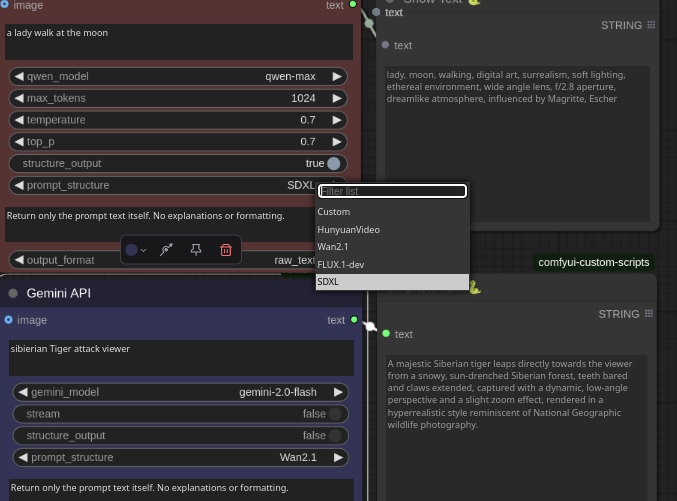

<div align="center">

# 🚀 ComfyUI GeminiOllama Extension

**Supercharge your ComfyUI workflows with AI superpowers**

[](https://github.com/yourusername/ComfyUI-OllamaGemini/stargazers)
[](https://opensource.org/licenses/MIT)
[](https://www.python.org/downloads/release/python-3100/)

</div>

This extension integrates Google's Gemini API, OpenAI (ChatGPT), Anthropic's Claude, Ollama, Qwen, and various image processing tools into ComfyUI, allowing users to leverage these powerful models and features directly within their ComfyUI workflows.

## Features

- Support for multiple AI APIs:
  - Google Gemini
  - OpenAI (ChatGPT)
  - Anthropic Claude
  - Ollama
  - Alibaba Qwen
- Text and image input capabilities
- Streaming option for real-time responses
- FLUX Resolution tools for image sizing
- ComfyUI Styler for advanced styling options
- Raster to Vector (SVG) conversion
- High-quality background removal (BRIA RMBG)
- Text splitting and processing
- Easy integration with ComfyUI workflows

## Nodes

<div align="center">

### 1. 🧠 Gemini API



Access Google's powerful Gemini models with advanced prompt enhancement:

- **Models:**
  - gemini-2.0-pro
  - gemini-2.0-flash
  - gemini-2.0-flash-lite-preview-02-05
  - gemini-2.0-pro-experimental-02-05
  - gemini-1.5-pro
  - gemini-1.5-flash-8b
  - gemini-1.5-pro-experimental
  - learnlm-1.5-pro-experimental

- **Prompt Enhancement:**
  - Automatically enhance basic prompts into detailed, model-specific instructions
  - Multiple prompt structure templates:
    - SDXL: Optimized for Stable Diffusion XL
    - Wan2.1: Specialized format for specific models
    - FLUX.1-dev: Enhanced format for FLUX models
    - HunyuanVideo: Specialized for video generation
    - Custom: Create your own prompt structure
  - Returns only the enhanced prompt without additional commentary

### 2. 🤖 OpenAI API

Access OpenAI's powerful language models:

- **Models:**
  - gpt-4o
  - gpt-4o-mini
  - gpt-4-turbo
  - gpt-4
  - gpt-3.5-turbo
  - gpt-3.5-turbo-0125
  - gpt-3.5-turbo-16k
  - gpt-3.5-turbo-1106
  - o1-preview/mini
  - deepseek-ai/deepseek-r1
  - deepseek-ai/deepseek-chat

### 3. 🧿 Claude API


Access Anthropic's Claude models for advanced language tasks:

- **Models:**
  - claude-3-opus-20240229
  - claude-3-sonnet-20240229
  - claude-3-haiku-20240307
  - claude-3.5-sonnet-20240620
  - claude-3-5-sonnet-20240620
  - claude-3-7-sonnet-20240620
  - claude-3.7-sonnet-20240620
- Temperature control
- System prompt configuration
- Streaming capability

### 4. 🖼️ Gemini Image Generator


Generate images directly with Google's Gemini 2.0 Flash model:

- Text prompt input for describing the desired image
- Negative prompt support to exclude unwanted elements
- System prompt customization
- Automatic saving to ComfyUI's output directory
- Returns both the generated image and any text response
- Uses the experimental image generation endpoint `gemini-2.0-flash-exp-image-generation`

### 5. 🦙 Ollama API

Integrate local language models running via Ollama:

- Text input field for prompts
- Dropdown for selecting Ollama models
- Customizable model options
- Run models locally without API keys

### 6. 🔄 Qwen API

Access Alibaba's Qwen language models:

- **Models:**
  - qwen-turbo
  - qwen-plus
  - qwen-max
  - qwen-max-longcontext
- Temperature control
- Streaming capability

### 7. 📐 FLUX Resolutions


Provides advanced image resolution and sizing options:

- Predefined resolution presets (e.g., 768x1024, 1024x768, 1152x768)
- Custom sizing parameters:
  - size_selected
  - multiply_factor
  - manual_width
  - manual_height

### 8. 🎨 ComfyUI Styler


Extensive styling options for various creative needs:

🎨 General Arts – A broad spectrum of traditional and modern art styles
🌸 Anime – Bring your designs to life with anime-inspired aesthetics
🎨 Artist – Channel the influence of world-class artists
📷 Camera – Fine-tune focal lengths, angles, and setups
📐 Camera Angles – Add dynamic perspectives with a range of angles
🌟 Aesthetic – Define unique artistic vibes and styles
🎞️ Color Grading – Achieve rich cinematic tones and palettes
🎬 Movies – Get inspired by different cinematic worlds
🖌️ Digital Artform – From vector art to abstract digital styles
💪 Body Type – Customize different body shapes and dimensions
😲 Reactions – Capture authentic emotional expressions
💭 Feelings – Set the emotional tone for each creation
📸 Photographers – Infuse the style of renowned photographers
💇 Hair Style – Wide variety of hair designs for your characters
🏛️ Architecture Style – Classical to modern architectural themes
🛠️ Architect – Designs inspired by notable architects
🚗 Vehicle – Add cars, planes, or futuristic transportation
🕺 Poses – Customize dynamic body positions
🔬 Science – Add futuristic, scientific elements
👗 Clothing State – Define the wear and tear of clothing
👠 Clothing Style – Wide range of fashion styles
🎨 Composition – Control the layout and arrangement of elements
📏 Depth – Add dimensionality and focus to your scenes
🌍 Environment – From nature to urban settings, create rich backdrops
😊 Face – Customize facial expressions and emotions
🦄 Fantasy – Bring magical and surreal elements into your visuals
🎃 Filter – Apply unique visual filters for artistic effects
🖤 Gothic – Channel dark, mysterious, and dramatic themes
👻 Halloween – Get spooky with Halloween-inspired designs
✏️ Line Art – Incorporate clean, bold lines into your creations
💡 Lighting – Set the mood with dramatic lighting effects
✈️ Milehigh – Capture the essence of aviation and travel
🎭 Mood – Set the emotional tone and atmosphere
🎞️ Movie Poster – Create dramatic, story-driven poster designs
🎸 Punk – Channel bold, rebellious aesthetics
🌍 Travel Poster – Design vintage travel posters with global vibes

### 9. ✒️ Raster to Vector (SVG) Conversion


Convert raster images to high-quality SVG vector graphics using vtracer:

**Raster to Vector node parameters:**

- **colormode**: Choose between "color" and "binary" (black and white)
- **mode**: Choose between "spline" (smooth curves) and "polygon" (straight lines)
- **filter_speckle**: Remove small artifacts (4-8 recommended)
- **color_precision**: Control color quantization (6-8 recommended)
- **corner_threshold**: Control how sharp corners are detected (60-80 recommended)
- **length_threshold**: Control minimum path length (2.0-4.0 recommended)
- **max_iterations**: Control curve fitting iterations (10-15 recommended)
- **splice_threshold**: Control path splicing (45 recommended)
- **path_precision**: Control path precision (5-8 recommended)
- **optimize**: Enable/disable SVG optimization

**Save SVG node options:**

- **filename_prefix**: Set the prefix for saved SVG files
- **create_preview**: Enable/disable preview generation
- **preview_width/height**: Set the size of the preview image
- **append_timestamp**: Add timestamp to filenames
- **custom_output_path**: Specify a custom output directory

**SVG Preview node:**

- **width/height**: Set the size of the preview image

#### Example Workflow:

1. Connect an image source to the "Convert Image to SVG" node
2. Configure the vectorization parameters for best quality
3. Connect the output to the "Save SVG File" node
4. Set the filename prefix and enable preview
5. The SVG will be saved to the output directory


> The SVG conversion feature uses vtracer for high-quality vectorization, producing clean and scalable vector graphics from raster images.

### 10. 🪄 BRIA RMBG (Background Removal)


High-quality background removal tool that produces clean masks and transparent images:

**BRIA RMBG node parameters:**

- **model_version**: Select the model version (2.0 recommended for best results)
- **image**: Input image to process

**Outputs:**

- **image**: The original image with transparent background
- **mask**: The generated alpha mask (white silhouettes on black background)

#### Example Workflow:

1. Connect an image source to the "BRIA RMBG" node
2. Set model_version to 2.0 for optimal results
3. Connect the image output to a preview node to see the transparent result
4. Connect the mask output to a preview node to see the generated mask

> The BRIA RMBG tool excels at preserving fine details like hair, thin stems, and complex edges while producing clean masks without artifacts.

### 11. 📝 TextSplitByDelimiter

Split text based on specified delimiters:

- Input text field
- Delimiter options:
  - split_regex
  - split_every
  - split_count

</div>


## 💻 Installation & Setup

<details open>
<summary><b>📦 Installation</b></summary>

### Method 1: ComfyUI Manager (Recommended)

1. Install [ComfyUI Manager](https://github.com/ltdrdata/ComfyUI-Manager) if you don't have it already
2. In ComfyUI, go to the Manager tab and search for "OllamaGemini"
3. Click Install

### Method 2: Manual Installation

1. Clone this repository into your ComfyUI's `custom_nodes` directory:
   ```bash
   cd /path/to/ComfyUI/custom_nodes
   git clone https://github.com/yourusername/ComfyUI-OllamaGemini.git
   ```

2. Install the required dependencies:
   ```bash
   pip install google-generativeai>=0.3.0 openai>=1.3.0 anthropic>=0.8.0 requests>=2.31.0 vtracer>=0.6.0
   ```

   Optional dependencies for enhanced functionality:
   ```bash
   # For additional SVG conversion methods (if needed)
   pip install pyautotrace cairosvg
   ```

3. Restart ComfyUI
</details>

<details open>
<summary><b>🔑 API Key Setup</b></summary>

### Option 1: Using the Config File

Create or edit `config.json` in the extension directory:

```json
{
  "GEMINI_API_KEY": "your_gemini_api_key",
  "OPENAI_API_KEY": "your_openai_api_key",
  "ANTHROPIC_API_KEY": "your_claude_api_key",
  "OLLAMA_URL": "http://localhost:11434",
  "QWEN_API_KEY": "your_qwen_api_key"
}
```

### Option 2: Using Environment Variables

Set the following environment variables:

```bash
GEMINI_API_KEY=your_gemini_api_key
OPENAI_API_KEY=your_openai_api_key
ANTHROPIC_API_KEY=your_claude_api_key
OLLAMA_URL=http://localhost:11434
QWEN_API_KEY=your_qwen_api_key
```

### Obtaining API Keys

<table>
<tr>
  <th>Provider</th>
  <th>Where to Get</th>
  <th>Free Tier</th>
</tr>
<tr>
  <td>Google Gemini</td>
  <td><a href="https://makersuite.google.com/app/apikey">Google AI Studio</a></td>
  <td>✅ Yes</td>
</tr>
<tr>
  <td>OpenAI</td>
  <td><a href="https://platform.openai.com/api-keys">OpenAI Platform</a></td>
  <td>❌ No</td>
</tr>
<tr>
  <td>Anthropic Claude</td>
  <td><a href="https://console.anthropic.com/">Anthropic Console</a></td>
  <td>✅ Limited</td>
</tr>
<tr>
  <td>Ollama</td>
  <td><a href="https://ollama.com/">Ollama</a> (runs locally)</td>
  <td>✅ Yes</td>
</tr>
<tr>
  <td>Alibaba Qwen</td>
  <td><a href="https://dashscope.console.aliyun.com/">DashScope Console</a></td>
  <td>✅ Limited</td>
</tr>
</table>
</details>

## 🔹 Quick Start Guide

<details open>
<summary><b>💬 Using AI API Services</b></summary>

1. Add the appropriate API node to your workflow (Gemini API, OpenAI API, Claude API, etc.)
2. Enter your prompt in the text field
3. Select the desired model from the dropdown
4. Adjust parameters like temperature and max tokens as needed
5. For enhanced prompts, enable "structure_output" and select a prompt structure template
6. Connect the output to other nodes in your workflow


</details>

<details>
<summary><b>🖼️ Generating Images with Gemini</b></summary>

1. Add the "Gemini Image Generator" node to your workflow
2. Enter your prompt describing the desired image
3. Optionally add a negative prompt to exclude unwanted elements
4. Connect the output to a preview node to see the generated image


</details>

<details>
<summary><b>🪄 Removing Backgrounds</b></summary>

1. Add the "BRIA RMBG" node to your workflow
2. Connect an image source to the input
3. Set model_version to 2.0 for best results
4. Connect the image output to see the transparent result
5. Connect the mask output to see the generated mask


</details>

<details>
<summary><b>✒️ Converting Images to SVG</b></summary>

1. Add the "Convert Image to SVG" node to your workflow
2. Connect an image source to the input
3. Configure the vectorization parameters
4. Connect the output to the "Save SVG File" node
5. Set a filename prefix and enable preview


</details>

## 🎬 Showcase

<div align="center">

### 🧠 AI API Services with Prompt Enhancement


*Transform simple prompts into detailed, model-specific instructions with multiple template options*

### 🖼️ Gemini Image Generation


*Generate stunning images directly with Google's Gemini 2.0 Flash model*

### 🪄 Background Removal with BRIA RMBG


*Remove backgrounds with precision while preserving fine details*

### 🎨 ComfyUI Styler


*Access hundreds of artistic styles and parameters for creative control*

### 📐 FLUX Resolutions


*Optimize image dimensions with predefined and custom resolution options*

### ✒️ SVG Conversion


*Convert raster images to high-quality SVG vector graphics*

</div>

## 🌟 Why Choose This Extension?

### Comprehensive API Integration

Access the most powerful AI models through a single interface:

- **Google Gemini**: gemini-2.0-pro, gemini-2.0-flash, gemini-1.5-pro, and more
- **OpenAI**: gpt-4o, gpt-4-turbo, gpt-3.5-turbo, and DeepSeek models
- **Anthropic Claude**: claude-3.7-sonnet, claude-3.5-sonnet, claude-3-opus, and more
- **Alibaba Qwen**: qwen-max, qwen-plus, qwen-turbo, qwen-max-longcontext
- **Ollama**: Run any local model with customizable parameters

### Advanced Prompt Enhancement

Transform simple prompts into detailed, model-specific instructions with specialized templates:

- **SDXL**: Optimized for Stable Diffusion XL with detailed artistic parameters
- **Wan2.1**: Specialized format with subject, setting, and style elements
- **FLUX.1-dev**: Enhanced format with depth effects and camera details
- **HunyuanVideo**: Specialized for video generation with cohesive descriptions
- **Custom**: Create your own prompt structure for specific needs

### High-Quality Tools

- **BRIA RMBG**: Best-in-class background removal with fine detail preservation
- **SVG Conversion**: High-quality vectorization with vtracer
- **FLUX Resolutions**: Precise image sizing with predefined and custom options
- **ComfyUI Styler**: Hundreds of artistic styles for creative control

## 👨‍💻 Contributing

Contributions are welcome! Here's how you can help:

- **Bug Reports**: Open an issue describing the bug and how to reproduce it
- **Feature Requests**: Suggest new features or improvements
- **Pull Requests**: Submit PRs for bug fixes or new features
- **Documentation**: Help improve or translate the documentation

## 📜 License

This project is licensed under the MIT License - see the LICENSE file for details.

---

<div align="center">

### ⭐ If you find this extension useful, please consider giving it a star! ⭐

</div>

